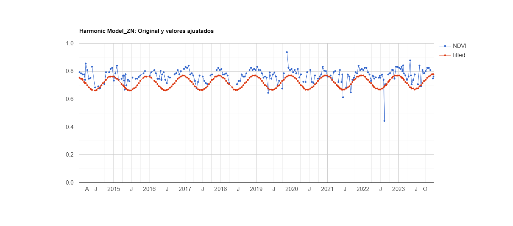
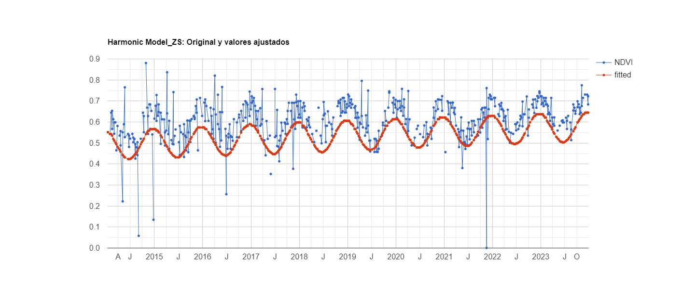
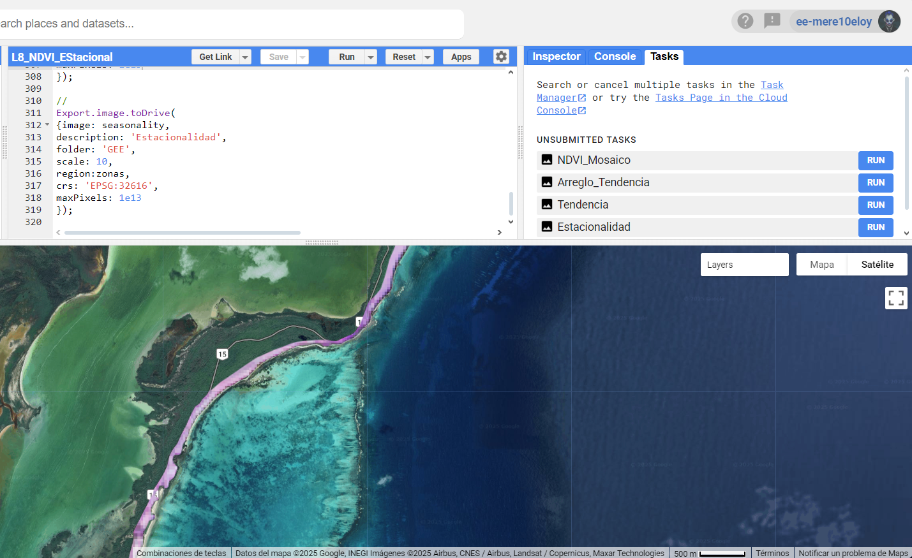

# Modelo_Armonico_NDVI_GEE
Estimación de umbrales y estacionalidad de la cobertura vegetal mediante NDVI con el modelo armónico de Fourier tomado y ajustado de GEE.
# Desarrollo de código y obtención de información para el estudio de la cobertura vegetal mediante NDVI, aplicado a landsat 8 en duna costera.

## Descripción 📋
El presente código esta desarrollado para estimar la estacionaldiad de la cobertura vegetal (sección_02) mediante el índice de vegetación de diferencia normalizada (NDVI), aplicado al catalago Landsat 8 (L8) dentro de la plataforma Google Earth Engine (GEE) para la region central del Caribe Mexicano, donde se ubica la Reserva de la Bisofera de Sian Ka´an (RBSK), Quintana Roo, México. Los cambios estacionales (fenológicos) de la cobertura vegetal en cada pixel de las imágenes apiladas, a través del tiempo, esta estimada para un periodo de 10 años (2014-2023). Información que puede ser descargada para su manejo externo. [**GEE**](https://developers.google.com/earth-engine/guides/getstarted?hl=en).

El repostirorio se elaboró de acuerdo a los lineamientos de la [**licencia GNU General Public License v3.0.**](https://choosealicense.com/licenses/gpl-3.0/).

##Visualización de la Reserva de la Bisofera de Sian Ka´an (RBSK), a tráves de la colección L8, en composición natural (SR_B: 4, 3, 2) y en infrarojo (SR_B: 5, 4, 3) en GEE.

;  .jpeg) 📖

Estimaciones.

Con la ejecución de este código obtendrá la estacionalidad fenológica a través del NDVI, mediante modelo ármonico para un periodo de 10 años (2014-2023), para la zona norte y sur de la RBSK. Además podrá exportar capas raster anuales y clasificada con los umbrales propuestos por zona de estudio.

Resultados para el periodo 2014-2023:

1.  

2. 

### Capas raster a exportar. 
Visualización de la Reserva de la Bisofera de Sian Ka´an (RBSK), mediante NDVI aplicado a la colección L8, exhibiendo estacionalidad fenológica de las bandas de fase, amplitud, y valor de NDVImediana en GEE. Las capas raster a exportar se ubican dentro de la pestaña Tasks, para su descarga en google drive y posteriormente ser descargadas a la PC personal para su manipulación. Este código fue elaborado mendiante la plataforma GEE. 

La manipulación de la información contenida en los rasaters puede realizarse, a traves, del sistema de información geografica de su preferencia. Para el presente caso de estudio se utilizó el software de acceso libre QGIS.

